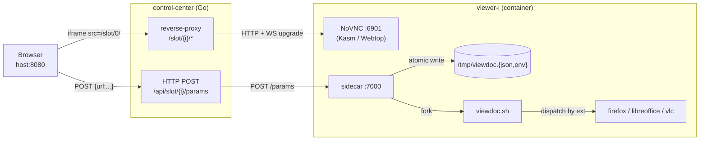

# AGENTS.md

## Goal

Remote streaming sandbox for **viewing files** (PDF, office docs, video, audio, images) in a browser-embedded iframe. Kasm / LinuxServer Webtop desktop containers fronted by a small **Go** control-center.

## Features

1. **Go stdlib.** Single static binary built on `net/http` + `httputil.ReverseProxy`.
2. **N slots, default 3.** Configured via `VIEWER_SLOTS` — comma-separated entries of the form `<vnc>[|<sidecar>]`. The vnc half accepts `http(s)://host[:port]`, plus two pseudo-schemes — `kasm://host[:port]` expands to `https://host:<VIEWER_KASM_DEFAULT_PORT>` (default `6901`), and `webtop://host[:port]` expands to `http://host:<VIEWER_WEBTOP_DEFAULT_PORT>` (default `3000`). The sidecar half accepts `http(s)://host[:port]`; when omitted, the sidecar inherits the vnc host on `VIEWER_SIDECAR_DEFAULT_PORT` (default `7000`). Mixed pools are first-class. See **README.md → Configuration** for worked examples.
3. **Plain HTTP.** Cleartext end-to-end across the compose network.
4. **Static slot topology.** Slots declared in `docker-compose.yml` and discovered by DNS hostname on the compose network.
5. **HTTP sidecar for params.** Each viewer image runs a tiny sidecar on `:7000` by default (override per-slot in `VIEWER_SLOTS` or globally via `VIEWER_SIDECAR_DEFAULT_PORT`); control-center pushes params via `POST http://<sidecar-host>:<sidecar-port>/params`.
6. **Stateless slot selection.** Slot picked by URL index or round-robin.

## Architecture



## Control Center (API)

Listens on `:8080`.

| Method | Path                     | Purpose |
|--------|--------------------------|---------|
| GET    | `/`                      | Landing page with `<iframe>` viewer + JS bridge. |
| GET    | `/healthz`               | Liveness + per-slot reachability map. |
| GET    | `/api/slots`             | `{count, slots:[{idx, host, ready}]}`. |
| POST   | `/api/slot/{i}/params`   | Forwarded verbatim to `<slot[i]>:7000/params`. |
| ANY    | `/slot/{i}/*`            | Reverse proxy → `<slot[i]>:<novnc>` (HTTP + WS upgrade). |
| GET    | `/static/*`              | Embedded assets (`embed.FS`). |

## Sidecar (API)

Binds to `:7000` in every viewer image. No auth — compose network is the trust boundary.

| Method | Path        | Purpose |
|--------|-------------|---------|
| POST   | `/params`   | Validate, atomically write `/tmp/viewdoc.{json,env}`, fork `viewdoc.sh`. |
| GET    | `/healthz`  | Liveness — `{"ok": true}`. |

`POST /params` body: `{"params": {"<key>": "<value>", ...}}`. Sanitization: key `^[A-Za-z][A-Za-z0-9_]{0,63}$`, ≤32 keys, ≤4096 bytes/value.

## Files (testing)

Sample URLs handy for poking each branch of `viewdoc.sh`. All serve the file directly (correct `Content-Type`, no HTML interstitial), so the VLC branch — which has no JS engine to follow a redirect — also works:

- PNG: <https://samplelib.com/lib/preview/png/sample-clouds-400x300.png>
- JPG: <https://samplelib.com/lib/preview/jpeg/sample-clouds-400x300.jpg>
- PDF: <https://www.w3.org/WAI/ER/tests/xhtml/testfiles/resources/pdf/dummy.pdf>
- DOCX: <https://calibre-ebook.com/downloads/demos/demo.docx>
- MP3: <https://samplelib.com/lib/preview/mp3/sample-3s.mp3>
- MP4: <https://samplelib.com/lib/preview/mp4/sample-5s.mp4>

Avoid `file-examples.com` URLs: that site gates downloads behind a 3-second JS redirect from `/wp-content/storage/…` to `/storage/<rotating-hash>/…`. Chromium and Firefox follow it; VLC and `curl` see only the HTML stub. The hash rotates, so hard-coding the post-redirect URL is fragile.

### How to verify each branch works

Drive the host page with agent-browser (`fill #url-input` + `click #url-form button[type=submit]`), then `screenshot` and check:

| Branch (ext)      | Dispatched to        | Pass criterion in the screenshot                                              |
|-------------------|----------------------|-------------------------------------------------------------------------------|
| `png` / `jpg`     | chromium `--new-window` (Kasm) or xdg-open → firefox (Webtop) | Image visible, tab title matches filename, URL bar shows the `/storage/<hash>/…` URL after the interstitial |
| `pdf`             | same as above        | Chromium's built-in PDF viewer (sidebar with page thumbnails); URL ends in `.pdf` |
| `docx` / office   | same as above        | **Currently no in-browser viewer** — chromium downloads the file (no LibreOffice in either image). To make this work, add `libreoffice` to `.docker/{kasm,webtop}/Dockerfile` and route office extensions to it in `viewdoc.sh`. |
| `mp3`/`mp4`/`mkv`/`webm`/`mov`/`avi`/`wav`/`flac`/`ogg`/`m4a` | `vlc --no-video-title-show` | VLC window visible playing the media |

When a file load looks broken, check in order:
1. `curl -sk <host>/api/slot/<i>/params -d '{"params":{"url":"…"}}'` returns `{"ok":true}` — proves the sidecar wrote `/tmp/viewdoc.{json,env}` and forked the hook.
2. The browser/VLC window is *open* in the desktop — `viewdoc.sh` de-dupes via `/tmp/.viewdoc_last_url`, so resubmitting the same URL is a no-op.
3. The slot's iframe is actually connected (KasmVNC shows "Connection Terminated: a new primary client connected" at the bottom when a fresh client takes over — that banner is normal, not an error).

### Known issue: KasmVNC primary-client lock

KasmVNC slots can wedge in "Connecting…" after a close/reopen from the same host — the previous primary client's lock isn't released cleanly on uncleanly-closed websockets. Symptom: even direct navigation to `https://<host>:<slot-port>/` hangs at the splash. Webtop slots recover by killing the old primary; KasmVNC slots may need a `docker compose restart viewer-kasm-*`. Worth investigating an idle-disconnect or force-takeover toggle.

### Clipboard sync

The iframe is created with `allow="autoplay; clipboard-read; clipboard-write; fullscreen"` (see `assets.go` / `app.js`), so noVNC's built-in clipboard channel can read/write the host clipboard. To verify by hand:

1. **Host → inner**: copy text on the host, focus the inner desktop (click into the iframe so noVNC gets keyboard focus), open the noVNC clipboard panel (or just Ctrl+V into an inner text field) — the host clipboard contents should appear.
2. **Inner → host**: select text inside the inner desktop, Ctrl+C, then read the host clipboard.

Headless agent-browser can't drive this end-to-end: mouse/keyboard events dispatched at the outer page don't reach the cross-origin noVNC canvas without prior focus, and `navigator.clipboard.read/writeText` from a script requires user activation. Use `--headed` (or a real browser) for clipboard validation.

## Browser testing (agent-browser)

For end-to-end checks use [`agent-browser`](https://github.com/agent-browser/agent-browser) — a CLI for headless/headed browser automation aimed at AI agents. It speaks Chrome via CDP, returns accessibility snapshots with stable `@refs`, and persists sessions through a daemon so commands can be chained with `&&`.

```bash
agent-browser open http://localhost:8080/
agent-browser snapshot -i                       # interactive elements only, with @refs
agent-browser eval "fetch('/api/slot/0/params', {method:'POST', headers:{'Content-Type':'application/json'}, body:JSON.stringify({params:{url:'https://example.com/x.pdf'}})}).then(r=>r.status)"
agent-browser screenshot ./out/slot0.png        # capture the iframe state
agent-browser get text @e1                      # read element text by ref
agent-browser console                           # browser console logs
agent-browser close --all
```

Useful flags: `--headed` to watch a run, `--session <name>` to isolate parallel runs, `--annotate` for vision-friendly screenshots, `--json` for machine-parseable output. Full command list: `agent-browser --help`; workflow patterns: `agent-browser skills get core --full`.

## What NOT to do

- ❌ No TLS, certs, openssl.
- ❌ No `/var/run/docker.sock`, no `docker exec`, no docker-cli inside any container.
- ❌ No dynamic slot spawning at runtime.
- ❌ No pool leasing / session IDs / TTL logic.
- ❌ No auth, rate limiting, DB.

## Resources

- **Kasm Workspaces** — streaming containerized desktops, NoVNC on `:6901`. <https://www.kasmweb.com/> · images: <https://hub.docker.com/u/kasmweb> · <https://github.com/kasmtech/workspaces-images>
- **LinuxServer Webtop** — alternative containerized desktop, NoVNC on `:3000`. <https://docs.linuxserver.io/images/docker-webtop/> · <https://github.com/linuxserver/docker-webtop>
- **NoVNC** — HTML5 VNC client over WebSockets (the protocol the reverse-proxy upgrades). <https://github.com/novnc/noVNC>
- **Go** — control-center language/runtime. <https://go.dev/>
