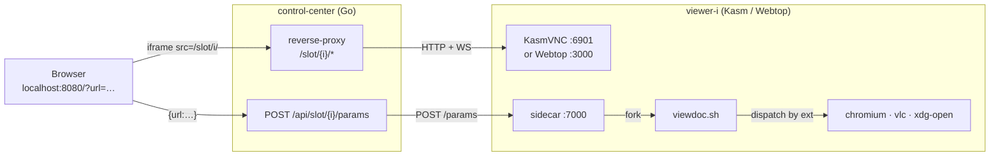

<h1 align=center>Dockette / Viewdoc</h1>

<p align=center>
    📄 🎞️ 🖼️ Browser-embeddable remote viewer for PDFs, office docs, audio, video, and images.
    A small Go control-center fronts a fixed pool of <a href="https://www.kasmweb.com/">Kasm</a> /
    <a href="https://docs.linuxserver.io/images/docker-webtop/">LinuxServer Webtop</a> desktop containers —
    pass <code>?url=...</code> and the file opens in the right app inside an iframe.
</p>

<p align=center>
🕹 <a href="https://f3l1x.io">f3l1x.io</a> | 💻 <a href="https://github.com/f3l1x">f3l1x</a> | 🐦 <a href="https://twitter.com/xf3l1x">@xf3l1x</a>
</p>

<p align=center>
  <a href="https://hub.docker.com/r/dockette/viewdoc/"></a>
  <a href="https://bit.ly/ctteg"></a>
  <a href="https://github.com/sponsors/f3l1x"></a>
</p>

-----

## Why

Embedding rich file viewers in your product is a thousand papercuts: PDF.js for some types, an office viewer for others, a media player for the rest — each with its own quirks, sandbox story, and asset list. **Viewdoc skips it.** Open a real desktop in a tab, let the *desktop* open the file with its native app, and stream the pixels back. One iframe, every file type.



## Quickstart

```sh
docker compose build
docker compose up -d

open https://localhost:8443/                                   # iframe + URL bar + slot tabs
open "https://localhost:8443/?url=https://example.com/x.pdf"   # auto-opens in slot 0
curl -sk https://localhost:8443/healthz                        # {"ready":4,"total":4}
```

Default pool (`VIEWER_SLOTS`): 2× Kasm + 2× Webtop.

## File Types

The dispatcher routes by extension:

| Group        | Extensions                                            | Opens with                    |
|--------------|-------------------------------------------------------|-------------------------------|
| Media        | `mp4`, `mkv`, `webm`, `mov`, `avi`, `mp3`, `wav`, `flac`, `ogg`, `m4a` | VLC |
| Web / docs   | `pdf`, `html`, `htm`                                  | Chromium (new window)         |
| Images       | `png`, `jpg`, `jpeg`, `gif`, `webp`, `svg`, `bmp`     | Chromium (new window)         |
| Office       | `doc`, `docx`, `odt`, `rtf`, `xls`, `xlsx`, `ods`, `csv`, `ppt`, `pptx`, `odp` | LibreOffice |
| Other        | anything else                                         | `xdg-open` (desktop default)  |

## Services

The system exposes two HTTP services. The **control-center** is the public entrypoint; the **sidecar** runs inside every viewer image on the compose network.

### Control Center — `:8080` (plain), `:8443` (TLS)

#### Endpoints

| Method | Path                         | Purpose                              |
|--------|------------------------------|--------------------------------------|
| GET    | `/`                          | UI: iframe + URL bar + slot tabs     |
| GET    | `/healthz`                   | `{ready, total}` reachability summary |
| GET    | `/api/slots`                 | slot table with per-slot reachability |
| POST   | `/api/slot/{i}/params`       | forwards `{params:{url,…}}` to slot `i` |
| ANY    | `/slot/{i}/*`                | reverse-proxy → `<slot[i]>:port` (HTTP + WS) |
| GET    | `/static/*`                  | embedded UI assets                    |

#### Environment

| Var             | Default                                                                                | Purpose                                  |
|-----------------|----------------------------------------------------------------------------------------|------------------------------------------|
| `LISTEN_ADDR`   | `:8080`                                                                                | Plain-HTTP bind address                  |
| `TLS_ADDR`      | _(unset)_                                                                              | If set, also bind TLS (self-signed cert) |
| `VIEWER_SLOTS`  | `viewer-1,viewer-2,viewer-3`                                                           | Comma-separated `[scheme://]host[:port]`.<br>**Kasm** — prefix `https://`, port `:6901`. KasmVNC serves self-signed HTTPS; the reverse-proxy skips cert verification.<br>**Webtop** — omit scheme (plain `http`), port `:3000`. The proxy patches kclient's `isSecureContext` check at response time so it loads under same-origin HTTP. |

### Sidecar — `:7000` (inside each viewer)

#### Endpoints

| Method | Path        | Purpose                                                  |
|--------|-------------|----------------------------------------------------------|
| GET    | `/healthz`  | `{"ok": true}`                                           |
| POST   | `/params`   | validate + atomically write `/tmp/viewdoc.{json,env}`, fork `viewdoc.sh` |

#### Environment

| Var             | Default     | Purpose                          |
|-----------------|-------------|----------------------------------|
| `LISTEN_ADDR`   | `:7000`     | Sidecar bind address (fixed by compose convention) |

-----

Consider to [support](https://github.com/sponsors/f3l1x) **f3l1x**. Also thank you for using this package.
