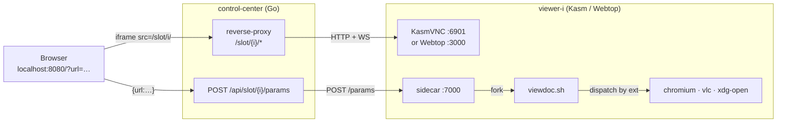

<h1 align=center>Dockette / Viewdoc</h1>

<p align=center>
    📄 🎞️ 🖼️ Browser-embeddable remote viewer for PDFs, office docs, audio, video, and images.
    A small Go control-center fronts a fixed pool of <a href="https://www.kasmweb.com/">Kasm</a> /
    <a href="https://docs.linuxserver.io/images/docker-webtop/">LinuxServer Webtop</a> desktop containers —
    pass <code>?url=...</code> and the file opens in the right app inside an iframe.
</p>

<p align=center>
🕹 <a href="https://f3l1x.io">f3l1x.io</a> | 💻 <a href="https://github.com/f3l1x">f3l1x</a> | 🐦 <a href="https://twitter.com/xf3l1x">@xf3l1x</a>
</p>

<p align=center>
  <a href="https://hub.docker.com/r/dockette/viewdoc/"></a>
  <a href="https://bit.ly/ctteg"></a>
  <a href="https://github.com/sponsors/f3l1x"></a>
</p>

-----

## Why

Embedding rich file viewers in your product is a thousand papercuts: PDF.js for some types, an office viewer for others, a media player for the rest — each with its own quirks, sandbox story, and asset list. **Viewdoc skips it.** Open a real desktop in a tab, let the *desktop* open the file with its native app, and stream the pixels back. One iframe, every file type.



## Quickstart

```sh
docker compose build
docker compose up -d

open https://localhost:8443/                                   # iframe + URL bar + slot tabs
open "https://localhost:8443/?url=https://example.com/x.pdf"   # auto-opens in slot 0
curl -sk https://localhost:8443/healthz                        # {"ready":4,"total":4}
```

Default pool (`VIEWER_SLOTS`): 2× Kasm + 2× Webtop.

## File Types

The dispatcher routes by extension:

| Group        | Extensions                                            | Opens with                    |
|--------------|-------------------------------------------------------|-------------------------------|
| Media        | `mp4`, `mkv`, `webm`, `mov`, `avi`, `mpeg`, `mpg`, `m4v`, `3gp`, `3g2`, `ts`, `mts`, `m2ts`, `vob`, `wmv`, `asf`, `divx`, `ogv`, `mp3`, `wav`, `flac`, `ogg`, `m4a`, `aac`, `opus`, `mka`, `wma`, `aiff`, `ape`, `mid` | VLC |
| Web / docs   | `pdf`, `html`, `htm`                                  | Chromium (new window)         |
| Images       | `png`, `jpg`, `jpeg`, `gif`, `webp`, `svg`, `bmp`     | Chromium (new window)         |
| Office       | `doc`, `docx`, `odt`, `rtf`, `xls`, `xlsx`, `ods`, `csv`, `ppt`, `pptx`, `odp` | LibreOffice |
| Archives     | `zip`, `7z`, `rar`, `tar`, `gz`, `tgz`, `bz2`, `tbz2`, `xz`, `txz` | Xarchiver (downloaded locally first) |
| Email        | `eml`                                                 | Claws Mail (downloaded locally first) |
| Captures     | `pcap`, `pcapng`, `cap`                               | Wireshark (downloaded locally first) |
| Other        | anything else                                         | `xdg-open` (desktop default)  |

## Services

The system exposes two HTTP services. The **control-center** is the public entrypoint; the **sidecar** runs inside every viewer image on the compose network.

### Control Center — `:8080` (plain), `:8443` (TLS)

#### Endpoints

| Method | Path                         | Purpose                              |
|--------|------------------------------|--------------------------------------|
| GET    | `/`                          | UI: iframe + URL bar + slot tabs     |
| GET    | `/healthz`                   | `{ready, total}` reachability summary |
| GET    | `/api/slots`                 | slot table with per-slot reachability |
| POST   | `/api/slot/{i}/params`       | forwards `{params:{url,…}}` to slot `i` |
| ANY    | `/slot/{i}/*`                | reverse-proxy → `<slot[i]>:port` (HTTP + WS) |
| GET    | `/static/*`                  | embedded UI assets                    |

#### Environment

| Var                            | Default                       | Purpose                                                                                              |
|--------------------------------|-------------------------------|------------------------------------------------------------------------------------------------------|
| `LISTEN_ADDR`                  | `:8080`                       | Plain-HTTP bind address                                                                              |
| `TLS_ADDR`                     | _(unset)_                     | If set, also bind TLS (self-signed cert)                                                             |
| `VIEWER_SLOTS`                 | `viewer-1,viewer-2,viewer-3`  | Comma-separated slot list. See **Slot configuration** below for the full grammar.                    |
| `VIEWER_KASM_DEFAULT_PORT`     | `6901`                        | VNC port used for bare entries and the `kasm://` pseudo-scheme.                                      |
| `VIEWER_WEBTOP_DEFAULT_PORT`   | `3000`                        | VNC port used for the `webtop://` pseudo-scheme.                                                     |
| `VIEWER_SIDECAR_DEFAULT_PORT`  | `7000`                        | Sidecar port used when the sidecar half of a slot entry is omitted (or specifies no port).           |

#### Slot configuration

Each entry in `VIEWER_SLOTS` has the shape `<vnc>[|<sidecar>]`. The pipe is optional — omit it when the sidecar lives on the same host as the VNC endpoint (the compose default).

**VNC half — accepted forms** (port falls back to `VIEWER_KASM_DEFAULT_PORT`, except `webtop://` which uses `VIEWER_WEBTOP_DEFAULT_PORT`):

| Input                          | Parsed as                                                  |
|--------------------------------|------------------------------------------------------------|
| `viewer-1`                     | `http://viewer-1:6901`                                     |
| `viewer-1:9000`                | `http://viewer-1:9000`                                     |
| `http://viewer-1`              | `http://viewer-1:6901`                                     |
| `https://viewer-1`             | `https://viewer-1:6901`                                    |
| `https://viewer-1:6901`        | `https://viewer-1:6901`  (canonical Kasm)                  |
| `kasm://viewer-1`              | `https://viewer-1:6901`  (kasm pseudo-scheme = https+kasm) |
| `kasm://viewer-1:9000`         | `https://viewer-1:9000`                                    |
| `webtop://viewer-1`            | `http://viewer-1:3000`  (webtop pseudo-scheme = http+webtop) |
| `webtop://viewer-1:9001`       | `http://viewer-1:9001`                                     |

**Sidecar half — accepted forms** (port falls back to `VIEWER_SIDECAR_DEFAULT_PORT`; `kasm://` / `webtop://` are not allowed here):

| Input                          | Parsed as                          |
|--------------------------------|------------------------------------|
| _(omitted)_                    | `http://<vnc-host>:7000`           |
| `viewer-1`                     | `http://viewer-1:7000`             |
| `viewer-1:7100`                | `http://viewer-1:7100`             |
| `http://other-host:7100`       | `http://other-host:7100`           |
| `https://sidecar-1:7443`       | `https://sidecar-1:7443`           |

**Worked examples**

```bash
# Compose (DNS-friendly, sidecar implicit on same host:7000)
VIEWER_SLOTS="kasm://viewer-kasm-1,kasm://viewer-kasm-2,webtop://viewer-webtop-1,webtop://viewer-webtop-2"

# Equivalent fully-explicit form
VIEWER_SLOTS="https://viewer-kasm-1:6901,https://viewer-kasm-2:6901,http://viewer-webtop-1:3000,http://viewer-webtop-2:3000"

# Nomad / dynamic ports — VNC and sidecar published on different host ports
VIEWER_SLOTS="kasm://10.0.0.5:23456|10.0.0.5:34567,kasm://10.0.0.6:11111|10.0.0.6:22222"

# Override the pool-wide defaults so bare entries become 7901 / 3100 / 7900
VIEWER_KASM_DEFAULT_PORT=7901
VIEWER_WEBTOP_DEFAULT_PORT=3100
VIEWER_SIDECAR_DEFAULT_PORT=7900
VIEWER_SLOTS="kasm://node-1,webtop://node-2"
# → slot 0 vnc=https://node-1:7901 sidecar=http://node-1:7900
# → slot 1 vnc=http://node-2:3100  sidecar=http://node-2:7900
```

### Sidecar — `:7000` (inside each viewer)

#### Endpoints

| Method | Path        | Purpose                                                  |
|--------|-------------|----------------------------------------------------------|
| GET    | `/healthz`  | `{"ok": true}`                                           |
| POST   | `/params`   | validate + atomically write `/tmp/viewdoc.{json,env}`, fork `viewdoc.sh` |

#### Environment

| Var             | Default     | Purpose                          |
|-----------------|-------------|----------------------------------|
| `LISTEN_ADDR`   | `:7000`     | Sidecar bind address (fixed by compose convention) |

-----

Consider to [support](https://github.com/sponsors/f3l1x) **f3l1x**. Also thank you for using this package.
